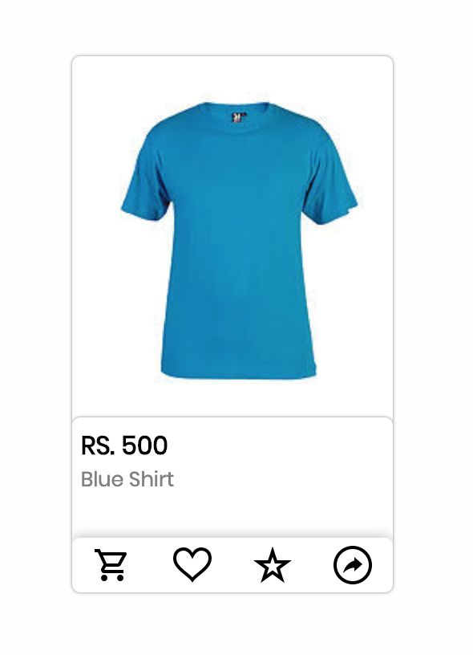

# Infinity React Card
 
A Card component built with React and displayed using infinity-react-cards
<!-- 
[![NPM Version][npm-image]][npm-url]
-->
[![Build Status][travis-image]][https://travis-ci.org/subeshb1/infinity-react-cards]
<!--[![Downloads Stats][npm-downloads]][npm-url] -->

Can be used to display items on an e-commerce site, with placeholder buttons for favouriting, 
sharing and starring



## Installation and setup

```sh
git clone git@github.com:subeshb1/infinity-react-cards.git
cd ./infinity-react-cards
npm i
npm run storybook
```

## Tests

```sh
npm run test
```
<!--
## Usage example

A few motivating and useful examples of how your product can be used. Spice this up with code blocks and potentially more screenshots.

_For more examples and usage, please refer to the [Wiki][wiki]._


## Release History

* 0.2.1
    * CHANGE: Update docs (module code remains unchanged)
* 0.2.0
    * CHANGE: Remove `setDefaultXYZ()`
    * ADD: Add `init()`
* 0.1.1
    * FIX: Crash when calling `baz()` (Thanks @GenerousContributorName!)
* 0.1.0
    * The first proper release
    * CHANGE: Rename `foo()` to `bar()`
* 0.0.1
    * Work in progress -->

<!-- ## Meta

Your Name – [@YourTwitter](https://twitter.com/dbader_org) – YourEmail@example.com

Distributed under the XYZ license. See ``LICENSE`` for more information.

[https://github.com/yourname/github-link](https://github.com/dbader/) -->

## Contributing

1. Fork (<https://github.com/subeshb1/infinity-react-cards>)
2. Create your feature branch (`git checkout -b feature/myNewFeature`)
3. Commit your changes (`git commit -am 'Add new feature'`)
4. Push to the branch (`git push origin feature/myNewFeature`)
5. Create a new Pull Request

<!-- Markdown link & img dfn's -->
<!-- [npm-image]: https://img.shields.io/npm/v/datadog-metrics.svg?style=flat-square
[npm-url]: https://npmjs.org/package/datadog-metrics
[npm-downloads]: https://img.shields.io/npm/dm/datadog-metrics.svg?style=flat-square
[travis-image]: https://img.shields.io/travis/dbader/node-datadog-metrics/master.svg?style=flat-square
[travis-url]: https://travis-ci.org/dbader/node-datadog-metrics
[wiki]: https://github.com/yourname/yourproject/wiki
 -->


